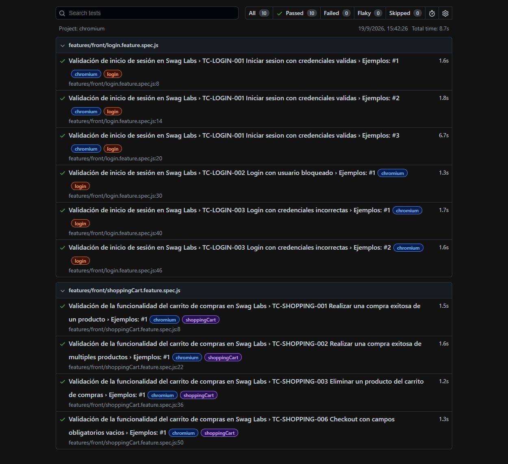

# Swag Labs - Automatización E2E con Playwright

[](https://github.com/matiasmurua1/ecommerce-swag-labs-playwright/actions/workflows/playwright.yml)

Proyecto de automatización End-to-End sobre [Swag Labs](https://www.saucedemo.com/), desarrollado con Playwright, TypeScript, Cucumber/Gherkin y el patrón Page Object Model.

## Tecnologías

- Playwright Test 1.63
- TypeScript
- `playwright-bdd`
- Cucumber / Gherkin en español
- Page Object Model (POM)
- ESLint y Prettier
- GitHub Actions

## Cobertura funcional

La suite contiene 7 escenarios que generan 10 ejecuciones por navegador y 30 ejecuciones en la matriz local completa.

| Módulo        | ID              | Validación                                            |
| ------------- | --------------- | ----------------------------------------------------- |
| Login         | TC-LOGIN-001    | Inicio de sesión exitoso con tres tipos de usuario    |
| Login         | TC-LOGIN-002    | Mensaje de error para usuario bloqueado               |
| Login         | TC-LOGIN-003    | Mensaje de error con usuario o contraseña incorrectos |
| Shopping Cart | TC-SHOPPING-001 | Compra exitosa de un producto                         |
| Shopping Cart | TC-SHOPPING-002 | Compra exitosa de múltiples productos                 |
| Shopping Cart | TC-SHOPPING-003 | Eliminación de un producto del carrito                |
| Checkout      | TC-SHOPPING-004 | Validación de campos obligatorios vacíos              |

## Arquitectura

```text
Features Gherkin
      ↓
Step definitions
      ↓
Fixtures de Playwright
      ↓
Page Objects
      ↓
Aplicación Swag Labs
```

- Los archivos `.feature` describen los comportamientos de negocio.
- Los steps separan las acciones (`When`) de las validaciones (`Then`).
- Las fixtures crean bajo demanda los Page Objects solicitados por cada escenario.
- Los Page Objects encapsulan locators y acciones sobre cada pantalla.
- Todos los Page Objects de un escenario comparten la misma página aislada de Playwright.

## Estructura

```text
ecommerce-swag-labs-playwright/
├── .github/workflows/playwright.yml
├── docs/assets/playwright-report-success.png
├── features/front/
│   ├── login.feature
│   └── shoppingCart.feature
├── pages/
│   ├── checkoutOverviewPage.ts
│   ├── homePage.ts
│   ├── loginPage.ts
│   ├── yourCartPage.ts
│   └── yourInformationPage.ts
├── steps_definitions/front/
│   ├── common.ts
│   └── shoppingCart.ts
├── support/fixtures.ts
├── eslint.config.mjs
├── playwright.config.ts
├── tsconfig.json
└── package.json
```

`playwright-bdd` transforma los archivos `.feature` en pruebas temporales dentro de `.features-gen/`. Esa carpeta se regenera antes de cada ejecución y no se versiona.

## Requisitos

- Node.js 22 o superior
- npm

## Instalación

```bash
npm ci
npx playwright install
```

Para instalar solamente el navegador utilizado por CI:

```bash
npx playwright install chromium
```

## Ejecución

```bash
# Suite completa en Chromium, Firefox y WebKit
npm test

# Suite de CI solamente en Chromium
npm run test:ci

# Interfaz web para elegir y ejecutar tests en Chromium
npm run test:ui:chromium

# Interfaz UI con todos los proyectos
npm run test:open

# Chromium visible
npm run test:headed

# Debug con Playwright Inspector
npm run test:debug

# Ejecución por tags de Cucumber
npm run test:login
npm run test:shopping-cart

# Abrir el último reporte HTML
npm run test:report
```

La URL se puede reemplazar sin modificar código:

```bash
BASE_URL=https://otro-ambiente.example npm test
```

En PowerShell:

```powershell
$env:BASE_URL='https://otro-ambiente.example'; npm.cmd test
```

## Calidad de código

```bash
# Validar formato, lint y tipos
npm run quality

# Aplicar formato automáticamente
npm run format

# Validaciones individuales
npm run format:check
npm run lint
npm run typecheck
```

GitHub Actions ejecuta automáticamente las validaciones de calidad y los 10 tests en Chromium ante cada `push` y `pull_request`.

## Decisiones de diseño

- Los Page Objects encapsulan locators y acciones; las aserciones permanecen en los steps.
- Los productos se buscan dinámicamente por nombre dentro de su tarjeta.
- Se priorizan atributos `data-test`, roles accesibles y locators acotados al componente.
- No se utilizan esperas fijas: Playwright administra el auto-waiting de acciones y aserciones.
- Cada prueba utiliza un contexto de navegador aislado.
- CI utiliza Chromium para mantener tiempos breves; localmente está disponible la matriz completa.

## Evidencias



- Reporte HTML local: `playwright-report/`
- Resultado JUnit: `test-results/junit-results.xml`
- Screenshots: solamente ante fallos
- Traces: retenidas ante fallos y visibles con `npx playwright show-trace <archivo.zip>`
- Video: deshabilitado para reducir el espacio ocupado por las evidencias

## Autor

**Matias Nahuel Murua Martinez**

## Licencia

Este proyecto se distribuye bajo la licencia [ISC](LICENSE).
